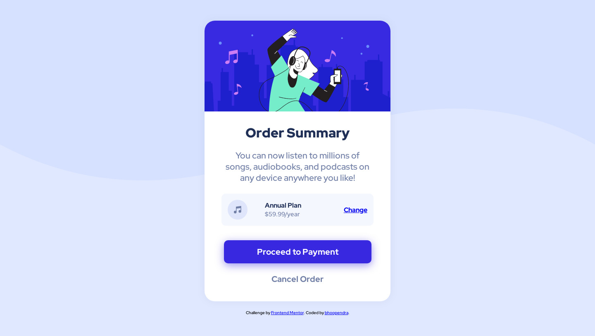

# Frontend Mentor - Order summary card solution

This is a solution to the [Order summary card challenge on Frontend Mentor](https://www.frontendmentor.io/challenges/order-summary-component-QlPmajDUj). Frontend Mentor challenges help you improve your coding skills by building realistic projects. 

## Table of contents

- [Overview](#overview)
  - [The challenge](#the-challenge)
  - [Screenshot](#screenshot)
  - [Links](#links)
- [Built with](#built-with)
- [Author](#author)

## Overview

### The challenge

Users should be able to:

- See hover states for interactive elements

### Screenshot

### Links

- Solution URL: [Click here](https://github.com/codebss-in/frontendmentor-projects/order-summary-component-main)
- Live Site URL: [Click here](https://codebss-in.github.io/frontendmentor-projects/order-summary-component-main/)

## Built with

- HTML5 markup
- CSS custom properties
- Flexbox

## Author

- Frontend Mentor - [@BssiN](https://www.frontendmentor.io/profile/BssiN)
- Instagram - [@_bh.oopendra](https://www.instagram.com/_bh.oopendra)
